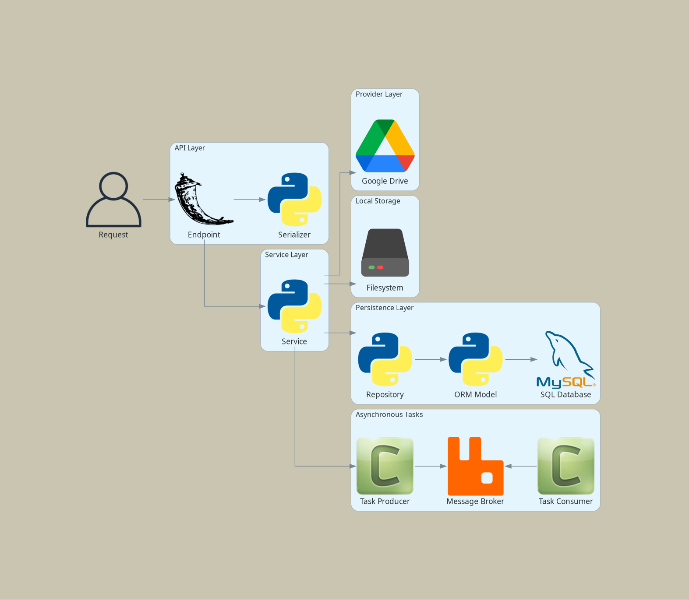

# Flask Api

Flask-api is a small API project for creating users and files (Microsoft Word and PDF). These files contain data about users registered in the project.

---

## 🛠️ Local Environment Installation

To set up locally, follow these steps:

### 1. Copy `.env.example` to `.env` and `.env.test`

- Create `.env` and `.env.test` files from the provided `.env.example` and update the necessary environment variables.

### 2. Create a Database User in SQL Docker Container

Ensure that your Docker container for `sql` is set up by running the following:

```bash
make local.build && make local.start
```

Next, connect to the SQL container:

```bash
docker exec -it flask_api_db bash
mysql -u root -p
```

In the MySQL shell, run the following commands to create a database, a user and grant privileges:

```sql
CREATE DATABASE flask_api;
CREATE USER 'user'@'%' IDENTIFIED BY 'newpassword';
GRANT ALL PRIVILEGES ON *.* TO 'user'@'%' WITH GRANT OPTION;
FLUSH PRIVILEGES;
```

You can stop the Docker app now: `make local.stop`.

### 3. Add the hostname in your hosts file, for example:

```bash
[...]
127.0.0.1 flask-api.local
[...]
```

### 4. Build and Run the Application

Once the database is set up, proceed to build and run the application with:

```bash
make local.start
cd src
make migrate
make seed
```

This will start the Flask application with the appropriate database setup.

### 5. Application Layer Components

The application follows a Domain Driven Design arquitecture:



1. **Serializer**: Converts data structures (often Python objects) to formats suitable for responses (e.g., JSON) and vice versa. Responsible for validating and transforming input/output data. Acts as a bridge between the endpoint (request/response) and the service layer, handling both serialization and deserialization.

2. **Service**: Contains the application’s use-case-specific logic. Handles requests from endpoints, manages workflow, and orchestrates interactions between managers. Delegates domain-specific logic to managers.

3. **Manager**: Encapsulates business rules and domain-specific workflows. Sits between the service and repository layers, ensuring that all necessary business logic is executed before or after data access. Managers prevent business rules from leaking into repositories and make logic reusable across services.

4. **Repository**: Abstracts data persistence and retrieval. Responsible solely for executing database queries and data manipulation. Provides an interface to interact with database models, isolating data access and keeping business logic out of the persistence layer.

5. **Database Model**: Defines the structure of the data as Python classes (typically using an ORM), mapping objects to database tables. Handles schema definition, relationships, and direct interaction with the database.


---

## 📄 License

This project is licensed under the MIT License.

---

## 📢 Contributing

We welcome contributions! Feel free to submit issues, feature requests, or pull requests to improve `flask_api`.
